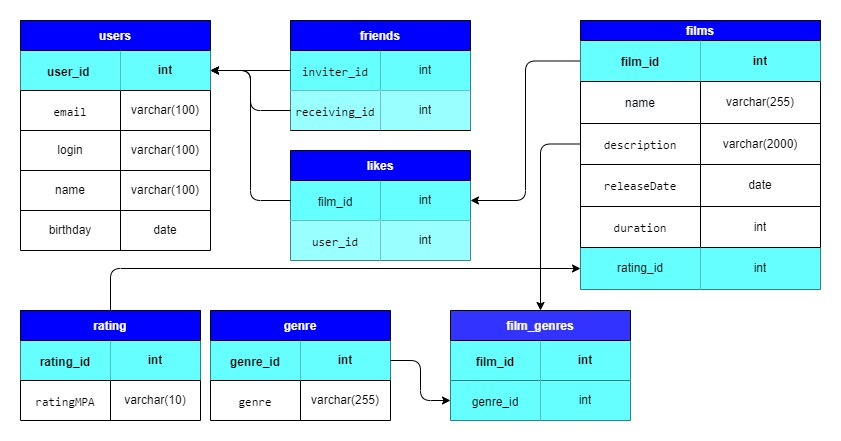

# java-filmorate
### ER-диаграмма


## Примеры запросов к БД
### Добавить пользователя
```
INSERT INTO user (email, login, name, birthday)
VALUES ('vv1111vv@mail.ru', 'vv1111vv', 'Владимир', '1998-04-15');
```

### Обновить пользователя
```
UPDATE user
SET name = 'Владимир'
WHERE user_id = 1; 
```
### Получение всех пользователей
```
SELECT * 
FROM users;
```
### Получение пользователя по id
```
SELECT * 
FROM users WHERE id = ?;
```
### Подружить двух пользователей
```
INSERT INTO friends (inviter_id, receiving_id, friendShip) 
VALUES (1, 2, true);
```
### Удалить пользователей из друзей
```
DELETE FROM friendship
WHERE (inviter_id = 1 AND receiving_id = 2)
OR (inviter_id = 2 AND receiving_id = 1);
```
### Добавить фильм
```
INSERT INTO film (name, description, releaseDate, duration, genre_id, rating_id) 
VALUES ('Матрица', 'Фильм с Киану Ривс', '1999-12-14', 136, 'фантастика, боевик', 1);
```
### Обновить фильм
```
UPDATE films
SET description = 'Лучший фильм с Киану Ривзом'
WHERE film_id = 1; 
```
### Отметить фильм как понравившийся пользователю
```
INSERT INTO `like` (user_id, film_id, created_at) 
VALUES (1, 1, '2022-05-14');
```
### Получение всех фильмов
```
SELECT * 
FROM films;
```
### Получение фильма по id
```
SELECT * 
FROM films WHERE id=?;
```
### Получение списка всех жанров
```
SELECT * 
FROM genres;
```
